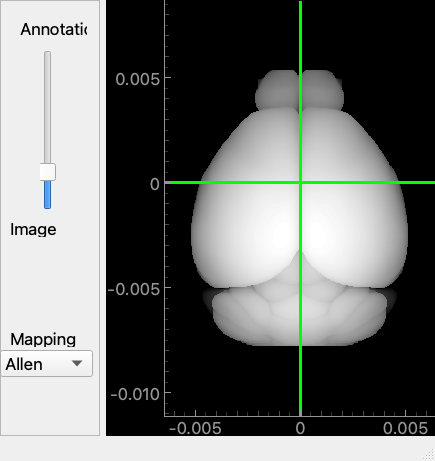
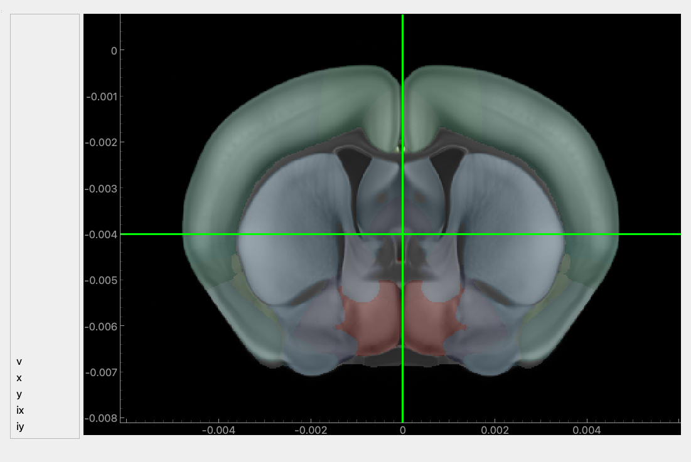
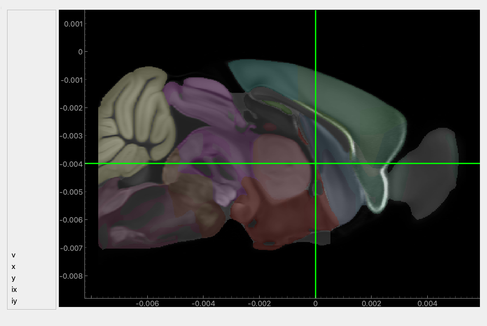
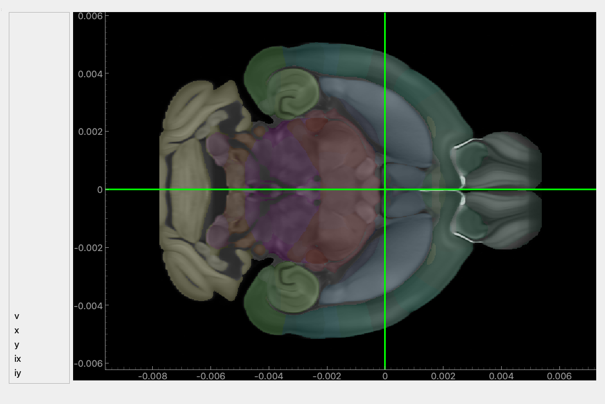
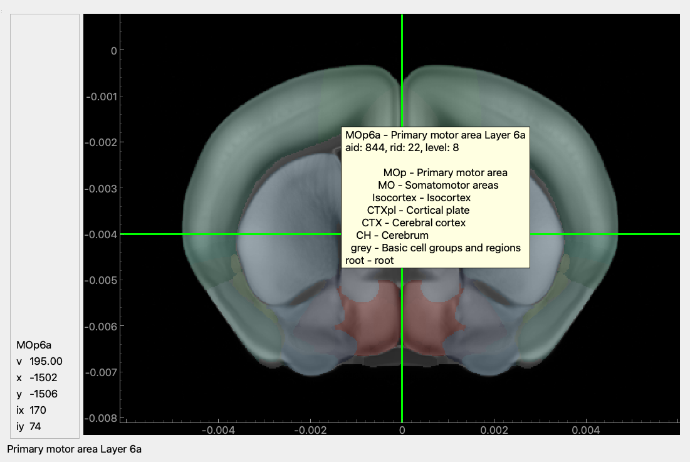
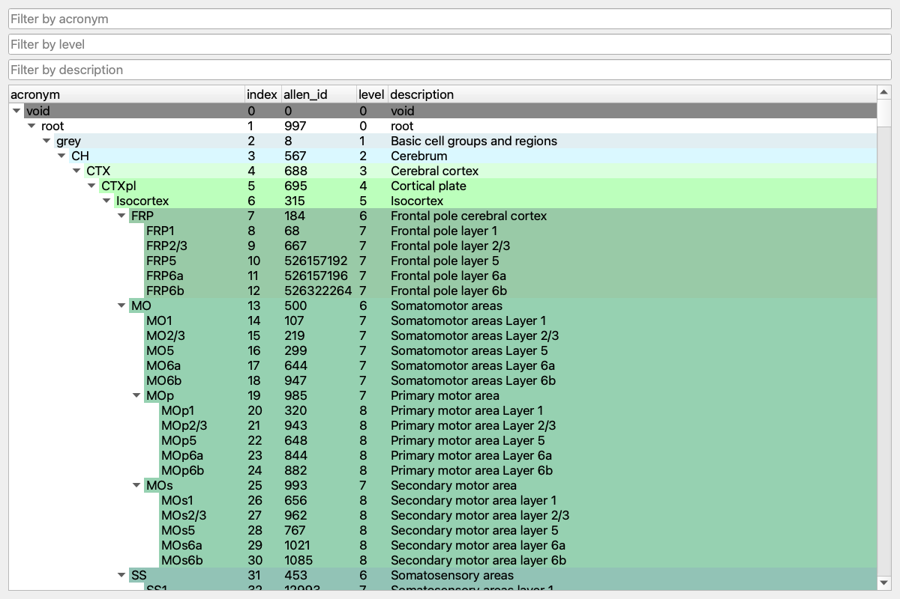
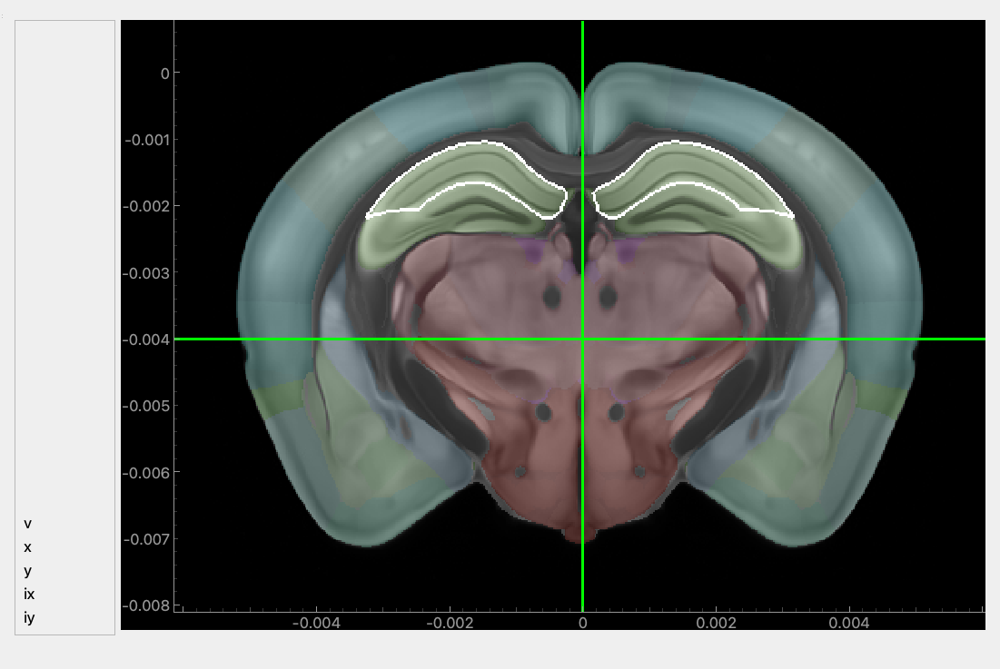

The atlas GUI shows the brain in linked windows: a view from above, coronal, sagittal and
horizontal slices, and the full region hierarchy as a tree. It is a quick way to browse the
hierarchy, scroll through slices, and see where a region sits in the brain.

The code on this page is not executed when the site is built.

## Install

The GUI needs the `gui` extra:

```bash
pip install "iblatlas[gui]"
```

ONE must be configured as for any other use of the atlas; see [Install iblatlas](install.qmd).

## Open the GUI

To browse the atlas, run the `atlas` command in a terminal:

```bash
atlas
```

To open it from Python, for example to show your own data, use a Jupyter notebook. Turn on
Qt event-loop integration first, then call `view()`:

```python
%gui qt
```

```python
from iblatlas.gui import atlasview

av = atlasview.view()
```

`view()` takes the atlas resolution in µm (`res=25` by default) or an atlas object
(`atlas=...`), and returns the main window, which you use to load data (see
[Show your own volume](#show-your-own-volume)).

## The windows

The main window is a view of the brain from above. Its slider fades the slices between the
region colours (Annotation) and the template image (Image), and its dropdown switches the
mapping.



Three slice windows open alongside it: coronal, sagittal and horizontal.







The green lines mark where the other slices cut through. Drag a line in any window and the
matching slice moves in every window.

The axes are in metres relative to bregma, so `-0.004` is 4000 µm from bregma on the negative
side of that axis. See
[Coordinates and volumes](../explanation/coordinates-and-volumes.qmd).

## Read a location

Hover over a slice to read the point under the cursor. The panel on the left shows the region
acronym and name, the volume value (`v`), the position along the window's horizontal and
vertical axes in µm (`x`, `y`) and the voxel indices (`ix`, `iy`). A tooltip gives the region's
acronym and name, its Allen id (`aid`), its index (`rid`) and its level, followed by every
region above it in the hierarchy, up to `root`.



## Find a region

The brain tree window lists every region in the hierarchy, with its acronym, index, Allen id,
level and description, coloured as in the atlas. Type in the boxes at the top to filter by
acronym, level or description; the tree keeps the parents of each match so you can see where
it sits.



Select a row to outline that region, together with every region below it in the hierarchy, in
each slice it appears in and on the top view. Move the slices to follow it through the brain.



For how the hierarchy is organised, see
[Brain region hierarchy](../explanation/brain-region-hierarchy.qmd).

## Switch mapping and blend

The dropdown in the main window switches the mapping used to colour the slices and to name the
region under the cursor: `Allen`, `Beryl`, `Cosmos` and `Swanson`, each also as a `-lr` version
that separates the two hemispheres. Switching from `Allen` to `Beryl` or `Cosmos` shows how
regions merge. See [Brain region mappings](../explanation/brain-region-mappings.qmd).

The slider fades between the region colours and the template image.

## Show your own volume

`set_volume` replaces the template image with any volume on the atlas's grid. This example
shows an Allen gene expression volume; the volumes come with their own 200 µm atlas, which is
passed to `view()`:

```python
import numpy as np
from iblatlas.genomics import agea

df_genes, expression_volumes, atlas_agea = agea.load(label='processed')
av = atlasview.view(atlas=atlas_agea)

volume = expression_volumes[690]
av.set_volume(volume, levels=np.nanpercentile(volume, [0.5, 99.5]))
```

`agea.load(label='processed')` returns a table of the 4345 experiments and their volumes, shape
(4345, 58, 41, 67) for experiment, ML, DV and AP. `set_volume` takes a `colormap` name
(`'magma'` by default) and `levels`, the display range; without `levels` it uses the 0.5th and
99.5th percentiles. Hover still reports the region, and `v` now reads from your volume.

See [Loading the gene expression atlas](load-gene-expression-agea.ipynb) for the data itself.
